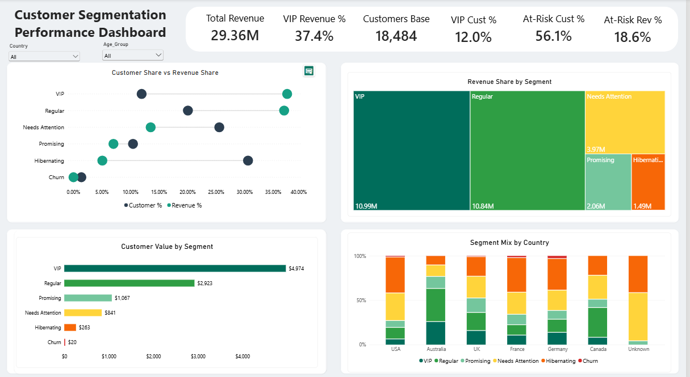
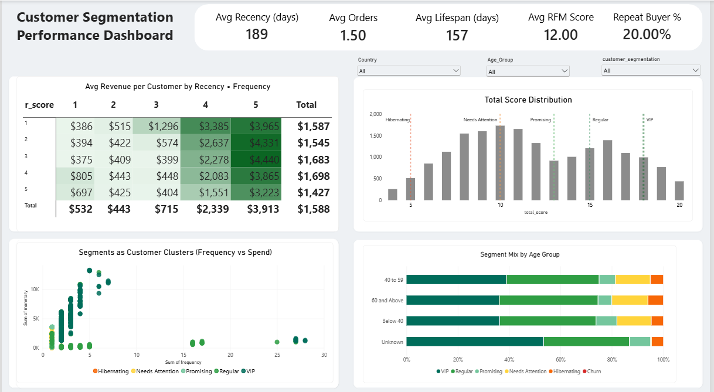

# 📊 Customer Segmentation with RFM + Lifespan

### MySQL scoring model → Power BI executive dashboard

<p align="center">
  
  
  
  
  
</p>

An end-to-end customer analytics project. It scores **18,484 customers** on Recency, Frequency, Monetary value and Lifespan with SQL window functions, assigns each to one of **6 segments**, and presents the results in a **two-page Power BI dashboard** built for a commercial or marketing lead.

`MySQL tables → rfm_customer_segments view → Power BI model → Executive dashboard`



---

## 🎯 Business problem

Without a scoring system, every customer gets the same offers, retention effort and marketing spend. This project answers three questions a commercial leader actually asks:

1. Which customers drive the business, and how concentrated is that value?
2. Which customers are slipping away while they still have value left to save?
3. Where should retention budget and VIP treatment go first?

## 🔑 Headline results

| Metric | Value |
|--------|-------|
| Customers scored | 18,484 |
| Total revenue | $29.36M |
| VIP share of customers → revenue | 12.0% → **37.4%** |
| VIP + Regular share of customers → revenue | 32.0% → **~74%** |
| At-risk customers (Needs Attention + Hibernating) | 56.1% of base, 18.6% of revenue ($5.46M) |
| Avg revenue per customer, VIP vs Churn | $4,974 vs $20 |

## 🧮 Approach

Each customer is scored on four dimensions built from `fact_sales` and `dim_customers`:

| Dimension | Definition | Better is |
|-----------|-----------|-----------|
| **R**ecency | Days from last order to the reference date | Lower |
| **F**requency | Number of distinct orders | Higher |
| **M**onetary | Total revenue | Higher |
| **L**ifespan | Days between first and last order (active span) | Higher |

Each dimension gets a **1–5 score** via `NTILE(5)` (5 = best). The four scores sum to a **total from 4 to 20**, which maps to a segment. All dates are anchored to the latest order in the dataset (not `CURDATE()`), and every `NTILE` uses `customer_key` as a tie-breaker so results are reproducible.

Full detail, including design choices and limitations: **[Documents/methodology.md](Documents/methodology.md)**.

### Segments

| Segment | Score | Customers | % Cust. | Revenue | % Rev. | Avg / customer |
|---------|-------|-----------|---------|---------|--------|----------------|
| 🏆 VIP | 18–20 | 2,210 | 12.0% | $10.99M | 37.4% | $4,974 |
| ⭐ Regular | 15–17 | 3,708 | 20.1% | $10.84M | 36.9% | $2,923 |
| 🌱 Promising | 13–14 | 1,930 | 10.4% | $2.06M | 7.0% | $1,067 |
| ⚠️ Needs Attention | 10–12 | 4,724 | 25.6% | $3.97M | 13.5% | $841 |
| 💤 Hibernating | 5–9 | 5,654 | 30.6% | $1.49M | 5.1% | $263 |
| 🚫 Churn | 4 | 258 | 1.4% | $0.005M | ~0% | $20 |

## 🔍 Key findings

1. **Revenue is highly concentrated.** VIP and Regular customers are 32% of the base and generate about 74% of revenue. Average revenue per customer falls in an unbroken line from $4,974 (VIP) to $20 (Churn), so the score orders customers by value as intended.
2. **Over half the base is at risk, but carries a fraction of revenue.** Needs Attention and Hibernating are 56.1% of customers and 18.6% of revenue ($5.46M): the best place for low-cost win-back effort.
3. **Frequency separates valuable customers far more than recency does.** In the recency × frequency heatmap, average revenue per customer rises from $532 to $3,913 across frequency scores 1 → 5, while it stays flat (about $1,430–$1,700) across recency scores 1 → 5. Part of this is mechanical (more orders means more revenue), so treat it as a design pointer, not proof of cause.
4. **"Churn" is a tiny, low-value group, not a warning sign.** The 258 Churn customers average $20 in lifetime spend. They look like one-off, low-value buyers rather than lapsed regulars.



## 💡 Decisions this supports

1. **Protect and grow the top 32%.** A small loss in VIP/Regular has an outsized revenue impact. Introduce a loyalty tier or account touchpoint for VIP, and an upsell/cross-sell push for Regular.
2. **Win back Needs Attention before Hibernating.** Needs Attention averages $841 per customer versus $263 for Hibernating. Assuming similar cost per contact, it offers the better return; move Hibernating to a low-cost automated flow.
3. **Design retention around frequency, not just "come back soon".** Reorder prompts, punch-card rewards and bundles that encourage a second and third order. Validate with an A/B test before scaling.
4. **Do not spend on paid win-back for Churn.** At $20 average lifetime spend, campaign cost will likely exceed recovered revenue. Use passive, no-cost channels only.

## 🗂️ Repository structure

```
customer-segmentation-rfm-sql-powerbi/
├── README.md
├── LICENSE
├── sql/
│   ├── 01_create_database.sql
│   ├── 02_create_tables.sql
│   ├── 03_load_data.sql
│   ├── 04_rfm_segmentation_view.sql    # the scoring view
│   ├── 05_validation_checks.sql        # data-quality and logic checks
│   └── 06_segment_summary.sql          # reproduces the README tables
├── dax/
│   └── measures.dax                    # 23 measures + Segment Order column
├── powerbi/
│   └── customer_segmentation_dashboard.pbix
├── docs/
│   ├── methodology.md
│   └── screenshots/
└── data/
    └── README.md                       # data source + schema (raw data not committed)
```

## ▶️ How to run

1. Get the source CSVs (see [Dataset) and put them in your MySQL `secure_file_priv` folder.
2. Run the SQL files in order, `01` → `06`, in MySQL Workbench (MySQL 8.0+ required).
3. Check `05_validation_checks.sql` results: row count, no duplicates, no NULL scores, and revenue reconciling to zero difference.
4. Run `06_segment_summary.sql` to reproduce the segment table above.
5. Open the `.pbix` in Power BI Desktop and point it at the `rfm_customer_segments` view (or rebuild: connect to the view, then add each item from `dax/measures.dax`).
6. Set **Sort by column → Segment Order** on `customer_segmentation` so visuals read VIP → Churn.

## 🛠️ Tools

- **MySQL 8+**: CTEs, window functions (`NTILE`), `TIMESTAMPDIFF`
- **Power BI Desktop**: DAX measures, conditional formatting, recency × frequency matrix heatmap, dumbbell chart
- **Domain background**: 13+ years in quality assurance and process control shaped the emphasis on reproducibility, validation checks and clearly documented thresholds

## ⚠️ Limitations

Scores use `NTILE`, so customers with identical raw values (for example, all one-order customers) are separated by `customer_key`. Segments are therefore reproducible but not perfectly tie-safe. This and other limitations are documented, with a proposed v2, in [Documents/methodology.md](Documents/methodology.md).

## 👤 Author

**Samuel Boye Abroquah** — Quality Assurance Supervisor transitioning into data analytics, based in Accra, Ghana.

[LinkedIn](TODO-add-link) · [Upwork](TODO-add-link)

Licensed under the [MIT License](LICENSE).
